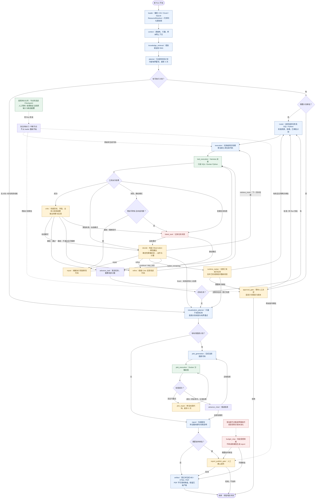

# 一次分析的完整工作流

按 2026-10-24 当前代码绘制。实线为主要执行或数据路径，虚线为支撑依赖、配置或说明。

```mermaid
flowchart TB
  START(["新 Run 开始"]) --> LOAD["loader：解析 CSV / Excel / SQLite<br/>ResourceResolver + 可序列化表快照"]
  LOAD --> CONTEXT["context：表结构、行数、样本等上下文"]
  CONTEXT --> KR["knowledge_retrieval：规划前全局 RAG"]
  KR --> PLAN["planner：生成并校验计划<br/>内部有界重写，最多 3 次"]
  PLAN --> HAS{"有可执行计划？"}
  HAS -->|无计划 / 校验失败收尾| VIZ
  HAS -->|有| NEED{"需要计划审批？"}
  NEED -->|否| ROUTER
  NEED -->|是| AP["approval_gate：等待人工决定<br/>固定计划指纹与版本"]
  AP -->|批准 / 同 Run 恢复| ROUTER["router：选择当前任务及 SQL / Python<br/>检查资源、依赖、已审批计划"]
  AP -->|拒绝| END(["结束：保留相应状态"])

  ROUTER --> EXEC["execution：任务级知识检索<br/>按当前工具生成代码"]
  EXEC --> TOOL["tool_execution：Harness 派发<br/>只读 SQL / Docker Python"]
  TOOL --> OUTCOME{"工具执行结果"}
  OUTCOME -->|成功| CRITIC["critic：检查目标、字段、业务口径和结果<br/>输出判断与反馈"]
  OUTCOME -->|其他失败，动态模式| DECIDE
  OUTCOME -->|失败，静态模式| STATIC{"错误可修复且未超次数？"}
  OUTCOME -->|依赖任务失败| FAILED["failed_task：记录任务失败"]
  STATIC -->|是| REPAIR["repair：根据执行错误修改代码"]
  STATIC -->|否| FAILED
  REPAIR --> TOOL

  CRITIC -->|动态模式| DECIDE["decide：构造 Observation → 模型建议<br/>确定性策略校验 → 动作与计数"]
  CRITIC -->|静态：通过| ADVANCE
  CRITIC -->|静态：不通过且可精修| REFINE["refine：根据 Critic 反馈改进代码"]
  CRITIC -->|静态：精修用尽| FAILED
  REFINE --> TOOL
  FAILED -->|动态模式| DECIDE
  FAILED -->|静态模式| ADVANCE
  DECIDE -->|repair| REPAIR
  DECIDE -->|refine| REFINE
  DECIDE -->|retrieve_more：下一次补检索| EXEC
  DECIDE -->|replan_remaining| REPLAN["runtime_replan：仅修订未执行任务<br/>合并已完成前缀并重新校验"]
  DECIDE -->|continue / skip_task| ADVANCE["advance_task：推进任务，重置局部计数"]
  DECIDE -->|finish：未完成项计入失败| VIZ
  REPLAN -->|有效且无需再次审批| ROUTER
  REPLAN -->|需要再次审批| AP
  REPLAN -->|无剩余任务 / 修订失败| VIZ
  ADVANCE --> MORE{"还有任务？"}
  MORE -->|有| ROUTER
  MORE -->|无| VIZ["visualization_planner：只基于成功任务<br/>图表计划校验与有界重试"]

  VIZ --> CHARTS{"有有效图表计划？"}
  CHARTS -->|无| REPORT
  CHARTS -->|有| PGEN["plot_generation：生成当前图表代码"]
  PGEN --> PEXEC["plot_execution：Docker 沙箱绘图"]
  PEXEC --> POK{"绘图成功？"}
  POK -->|否且可重试| PREPAIR["plot_repair：修复绘图代码，最多 3 次"]
  PREPAIR --> PEXEC
  POK -->|成功 / 修复用尽，记录结果| PADV["advance_chart：推进图表"]
  PADV -->|还有图表| PGEN
  PADV -->|全部处理完| REPORT["report：生成报告<br/>附证据来源与失败说明"]
  REPORT --> PNEED{"需要发布审批？"}
  PNEED -->|否| ART
  PNEED -->|是| PUB["report_publish_gate：人工确认发布"]
  PUB -->|批准| ART["artifact：登记并生成 MD / HTML / PDF<br/>PDF 不可用时降级，保留已有产物"]
  PUB -->|拒绝，不发布| END
  ART --> END

  TRIGGER["受治理节点触发预算耗尽<br/>或受控知识版本变化"] -.-> STOP["budget_stop：构造受控收尾<br/>不再调用模型生成 report"]
  STOP -->|需要发布审批| PUB
  STOP -->|不需审批| ART
  CHECKPOINT["启用持久化时：节点状态进 Checkpoint<br/>人工等待 / 故障恢复沿用原输入与候选配置"]
  CHECKPOINT -. 同 Run 恢复 .-> RESUME["恢复待执行 / 中断节点<br/>不从 loader 重新开始"]
  RESUME -. 例如待生成代码 .-> EXEC
  RESUME -. 例如计划审批 .-> AP
  RESUME -. 例如发布审批 .-> PUB

  classDef normal fill:#EAF3FF,stroke:#4569A1,color:#16345A;
  classDef review fill:#FFF3D6,stroke:#A98127,color:#60470E;
  classDef guarded fill:#E8F5EC,stroke:#43845B,color:#204C30;
  classDef stopped fill:#FDECEC,stroke:#AE5A5A,color:#702A2A;
  class LOAD,CONTEXT,KR,PLAN,ROUTER,EXEC,VIZ,PGEN,REPORT,ART normal;
  class CRITIC,DECIDE,REPAIR,REFINE,REPLAN,PREPAIR,AP,PUB review;
  class TOOL,PEXEC,CHECKPOINT guarded;
  class FAILED,TRIGGER,STOP stopped;
```
