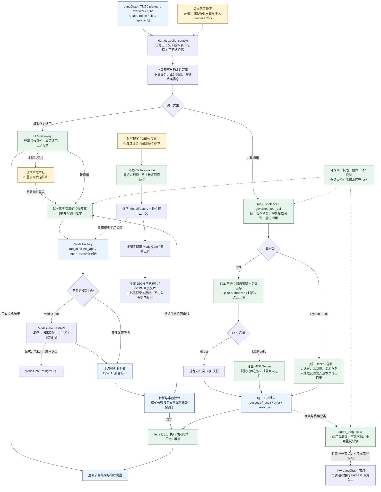

# Harness 与调用治理

按 2026-10-24 当前代码绘制。实线为主要执行或数据路径，虚线为支撑依赖、配置或说明。

```mermaid
flowchart TB
  NODE["LangGraph 节点：planner / executor / critic<br/>repair / refine / plot / reporter 等"] --> CTX["Harness.build_context<br/>任务上下文 + 授权表 + 证据 + 已确认记忆"]
  PROFILE["版本配置快照<br/>经验与附加指引只直接注入 Planner / Critic"] -.-> CTX
  CTX --> BOUND["字段预算与确定性裁剪<br/>保留任务、业务知识、关键错误信息"]
  BOUND --> TYPE{"调用类型"}

  TYPE -->|模型逻辑调用| GATE["LLMGateway<br/>逻辑操作身份、幂等复用、租约检查"]
  GATE -->|已有完成结果| RETURN["返回节点结果与治理度量"]
  GATE -->|未确认请求| REVIEW["请求重放审批<br/>不重发则受控终止"]
  REVIEW -->|明确允许重发| BUDGET
  GATE -->|新调用| BUDGET["每次真实请求前检查预算<br/>计数并写调用账本"]
  BUDGET --> FACTORY["ModelFactory<br/>run_id / client_app / agent_name 追踪头"]
  FACTORY --> DEST{"配置的模型地址"}
  DEST -->|ModelGate| MG["ModelGate FastAPI<br/>鉴权 → 模型路由 → 并发 / 请求配额"]
  MG --> PROVIDER["上游模型服务商<br/>OpenAI 兼容接口"]
  MG -. 请求、Token、成本记录 .-> MGDB["ModelGate PostgreSQL"]
  DEST -->|直连兼容服务| PROVIDER
  PROVIDER --> PARSE["解析与字段校验<br/>格式失败按有界重试重新发起请求"]
  PARSE -->|格式失败且可重试| BUDGET
  PARSE -->|成功| SETTLE["完成登记、执行时间结算、日志 / 度量"]
  SETTLE --> RETURN

  TYPE -->|工具调用| DISPATCH["ToolDispatcher + governed_tool_call<br/>统一检查预算、解析授权资源、登记调用"]
  DISPATCH --> TOOL{"工具类型"}
  TOOL -->|SQL| SQL["SQL 防护：词法策略 + 只读连接<br/>SQLite Authorizer + 时间 / 结果上限"]
  SQL --> SQLMODE{"SQL 后端"}
  SQLMODE -->|direct| SQLRUN["进程内只读 SQL 执行"]
  SQLMODE -->|MCP stdio| MCP["独立 MCP Server<br/>授权配置在沙箱挂载目录之外"]
  TOOL -->|Python / Plot| DOCKER["一次性 Docker 容器<br/>只读根、无网络、资源限制<br/>只挂载获准输入及本次输出目录"]
  SQLRUN --> OUT["统一工具结果<br/>success / result / error / error_kind"]
  MCP --> OUT
  DOCKER --> OUT
  OUT --> SETTLE
  OUT -. 观察与错误分类 .-> POLICY["agent_loop.policy<br/>动作合法性、重试次数、不可重试错误"]
  POLICY -. 控制下一节点，不放宽工具权限 .-> NEXT["下一 LangGraph 节点<br/>再次通过相同 Harness 调用入口"]

  META["外层提案 / GEPA 反思<br/>不经过任务内完整幂等账本"] --> QUOTA["外层 CallAllowance<br/>逐请求预扣 / 整批最坏额度预留"]
  QUOTA --> MFACTORY["外层 ModelFactory + 独立调用上下文"]
  MFACTORY --> MUP["按配置调用 ModelGate / 兼容上游"]
  MUP --> MRETURN["提案 JSON 严格校验 / GEPA 候选文本<br/>由外层记录与控制，不进入任务内账本"]
  MFACTORY -. 复用模型工厂实现 .-> FACTORY
  RULE["硬规则：权限、预算、动作限制<br/>候选经验不能修改这些代码"] -.-> DISPATCH
  RULE -.-> BUDGET
  RULE -.-> POLICY

  classDef normal fill:#EAF3FF,stroke:#4569A1,color:#16345A;
  classDef trusted fill:#E8F5EC,stroke:#43845B,color:#204C30;
  classDef soft fill:#FFF3D6,stroke:#A98127,color:#60470E;
  class NODE,FACTORY,PROVIDER,PARSE,RETURN,OUT normal;
  class GATE,BUDGET,DISPATCH,SQL,MCP,DOCKER,SETTLE,POLICY,QUOTA,RULE trusted;
  class PROFILE,META,REVIEW soft;
```
